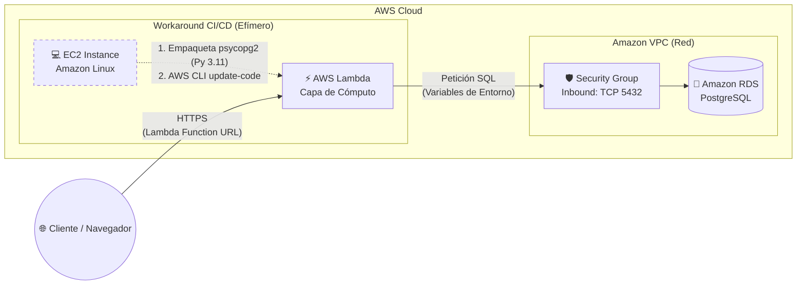
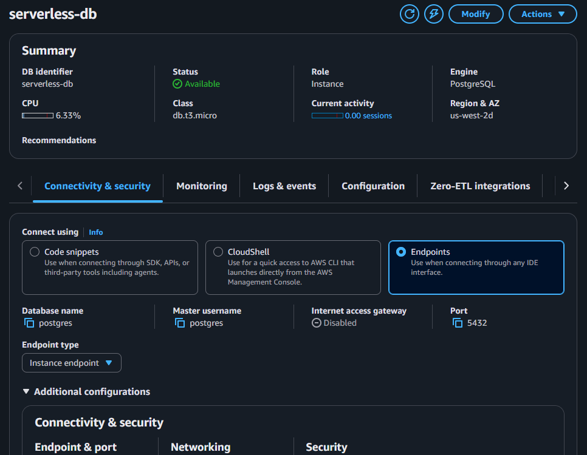
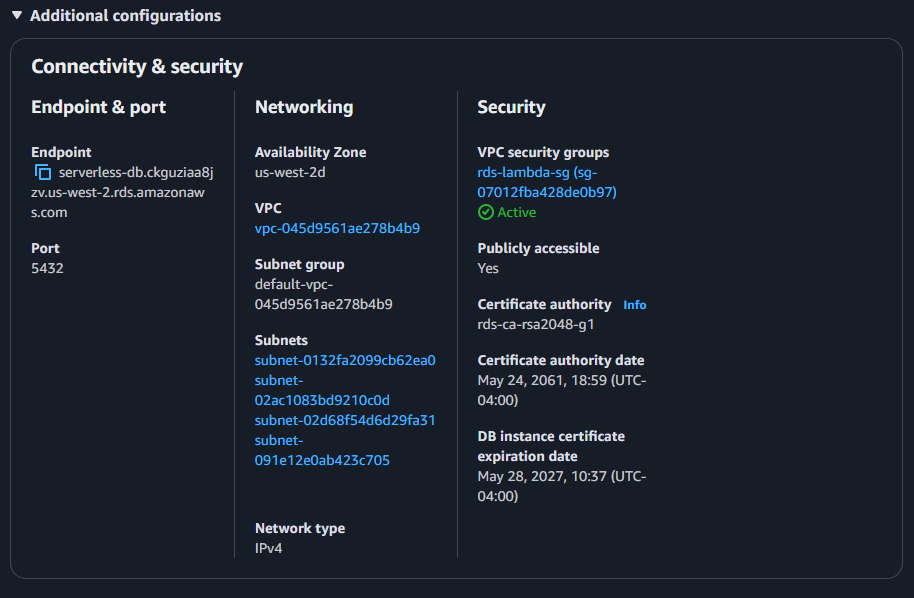
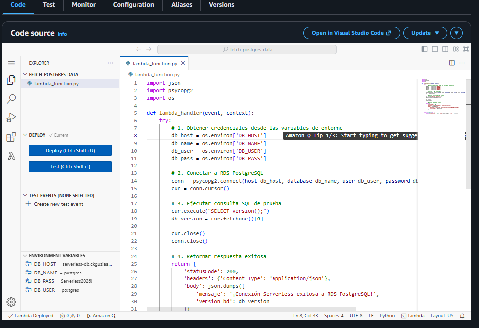
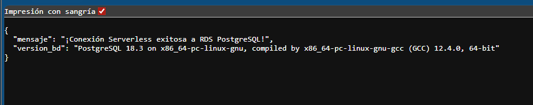
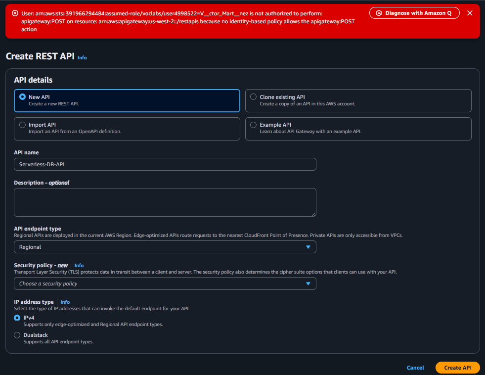
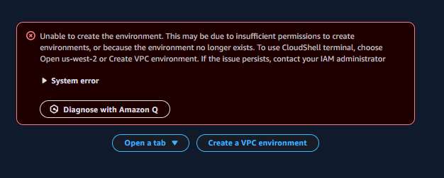
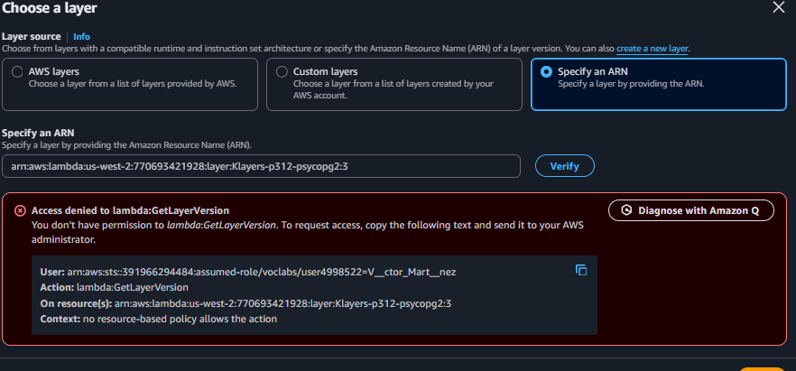
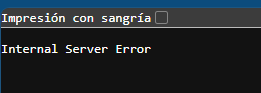
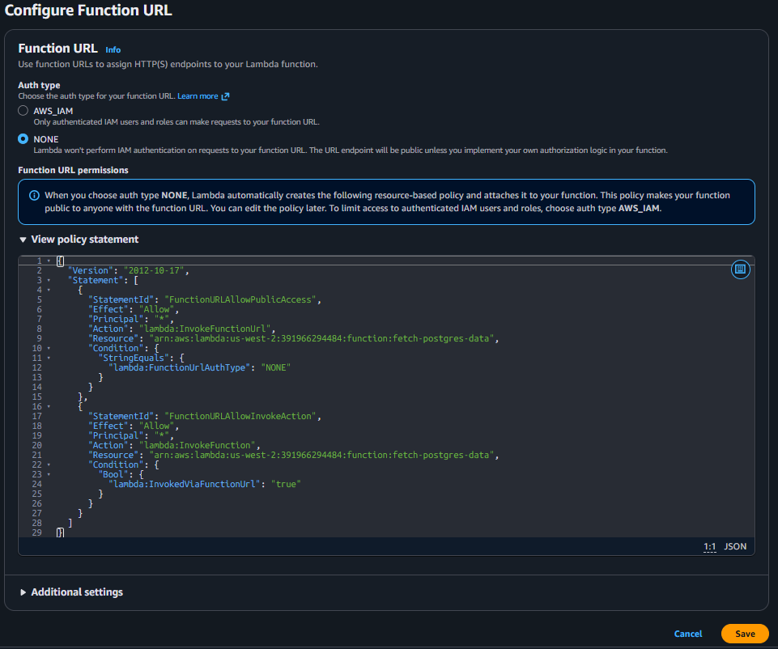

# ☁️ Serverless Postgres API con Workarounds Zero-Trust

Este repositorio documenta la arquitectura, el despliegue y la resolución de problemas (troubleshooting) de una API Serverless gestionada en AWS. El proyecto integra **AWS Lambda (Python 3.11)** y **Amazon RDS (PostgreSQL)** para crear un backend robusto.

Más allá de ser un despliegue estándar, este proyecto demuestra habilidades avanzadas de ingeniería en la nube al sortear políticas de seguridad restrictivas (IAM Zero-Trust) y problemas de dependencias en tiempo de ejecución.

---

## 🏗️ Arquitectura y Flujo de Datos

A continuación se detalla la arquitectura implementada, incluyendo el flujo efímero utilizado para sortear los bloqueos de empaquetado:

### 🛠️ Tecnologías Utilizadas
*   **Capa de Cómputo:** `AWS Lambda` (Python 3.11).
*   **Capa de Datos:** `Amazon RDS` (PostgreSQL, Single-AZ, `db.t3.micro`).
*   **Orquestación CI/CD:** `Amazon EC2` (Temporal) & `AWS CLI`.
*   **Red y Seguridad:** `VPC Security Groups`, `Lambda Environment Variables` (manejo de secretos).
*   **Exposición Web:** `AWS Lambda Function URLs` (HTTPS nativo).

---

## 🚧 Retos de Arquitectura y Soluciones (Troubleshooting)

Durante el despliegue en un entorno con políticas IAM estrictas, surgieron bloqueos que impidieron el flujo tradicional.

### 1. Bloqueo de Dependencias y `Runtime.ImportModuleError`
*   **El Problema:** El entorno bloqueó la descarga de Lambda Layers públicas y el acceso a CloudShell. Además, el OS de compilación generaba binarios de `psycopg2` para Python 3.9, lo que provocaba un error crítico (`Runtime.ImportModuleError`) al ejecutarse en la Lambda configurada con Python 3.11.
*   **La Solución:** Se diseñó un flujo de CI/CD efímero. Se aprovisionó una instancia EC2 temporal con el script de [User Data Bash](scripts/ec2_user_data.sh). Este script instaló explícitamente Python 3.11, descargó la librería correcta (`psycopg2-binary`), comprimió el código de la [función Lambda](src/lambda_function.py) en un Deployment Package y forzó la actualización de la Lambda mediante AWS CLI. Tras el éxito, la instancia fue destruida.

### 2. Bloqueo de Amazon API Gateway
*   **El Problema:** Denegación de permisos (`apigateway:POST` denied) al intentar crear la API pública.
*   **La Solución:** Se pivotó la arquitectura hacia **AWS Lambda Function URLs**, logrando exponer el backend a internet mediante un endpoint HTTPS nativo, sin depender del servicio bloqueado y reduciendo la latencia de red.

---

## 📸 Evidencia de Configuración y Despliegue (Principal)

### 1. Base de Datos RDS Desplegada
Instancia PostgreSQL en estado "Available" con su respectivo Endpoint y Security Group (Puerto 5432).

### 2. Inyección Segura de Credenciales
Uso de Variables de Entorno en AWS Lambda para conectar la lógica backend con la base de datos sin exponer contraseñas en el código fuente.

### 3. Validación Final (Éxito)
Petición HTTP a la Function URL desde el navegador, retornando la versión exacta del motor PostgreSQL y demostrando conectividad Serverless total.

---

## 📂 Galería de Evidencia Extendida (Proceso y Errores)

Para ver la documentación visual detallada de los errores de IAM y el Troubleshooting, consulta las capturas correspondientes abajo:

<b>❌ Error 1: Denegación de creación en Amazon API Gateway</b>

Muestra el bloqueo de permisos al intentar crear una REST API de API Gateway (`err_apigateway.png`).

<b>❌ Error 2: Bloqueo de entorno AWS CloudShell</b>

Muestra el mensaje de denegación al intentar iniciar CloudShell en la consola de AWS (`err_cloudshell.png`).

<b>❌ Error 3: Bloqueo de uso de Lambda Layers externas</b>

Bloqueo de seguridad al intentar adjuntar una capa ARN pública (`err_lambda_layer.png`).

<b>❌ Error 4: Error de Servidor Interno (Incompatibilidad de psycopg2)</b>

Error `Runtime.ImportModuleError` en los logs de CloudWatch debido a incompatibilidad de dependencias compiladas (`err_internal_server.png`).

<b>✅ Solución: Configuración Exitosa de Lambda Function URL</b>

Ajustes de la Function URL con tipo de autorización `NONE` para saltarse las restricciones de API Gateway (`sol_function_url.png`).

---

## 🚀 Lecciones Aprendidas y Habilidades Demostradas

*   **Resiliencia Arquitectónica:** Capacidad para rediseñar infraestructuras sobre la marcha usando alternativas nativas (Function URLs vs API Gateway).
*   **Resolución de Problemas Backend:** Diagnóstico profundo de incompatibilidades de ejecución (`Runtime.ImportModuleError`) e igualación de entornos de empaquetado/ejecución con Python y SQL.
*   **Automatización e Infraestructura:** Uso de Bash Scripting en el User Data para convertir una instancia EC2 en un servidor de despliegue automatizado.
*   **Seguridad en la Nube:** Aplicación de principios de seguridad gestionando el tráfico con Security Groups y resguardando credenciales con Environment Variables.